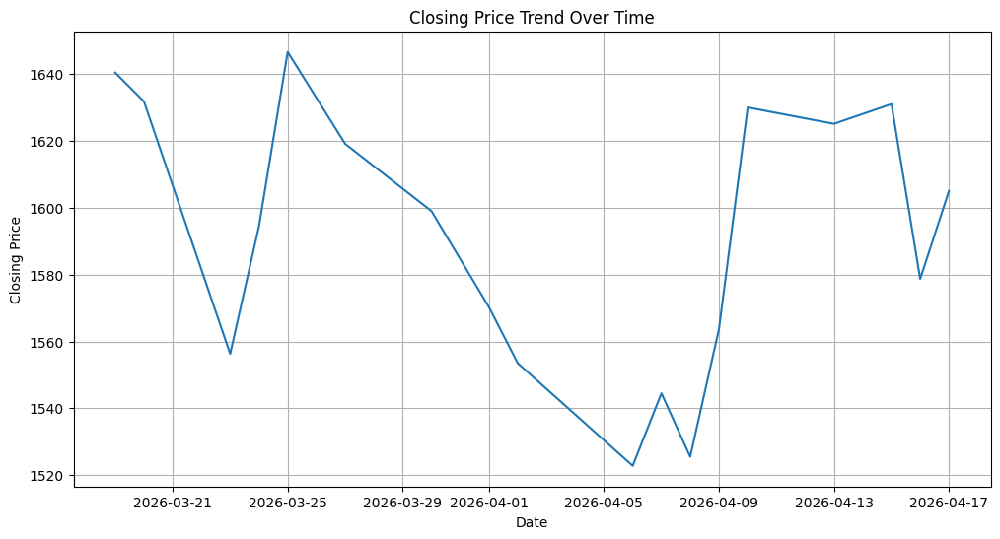
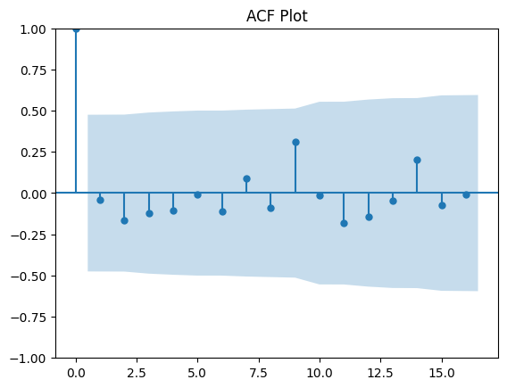
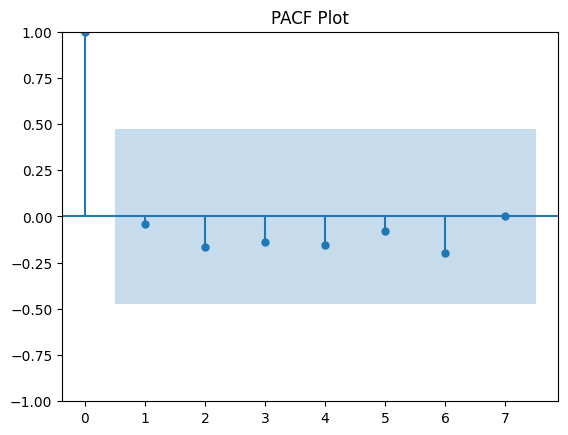
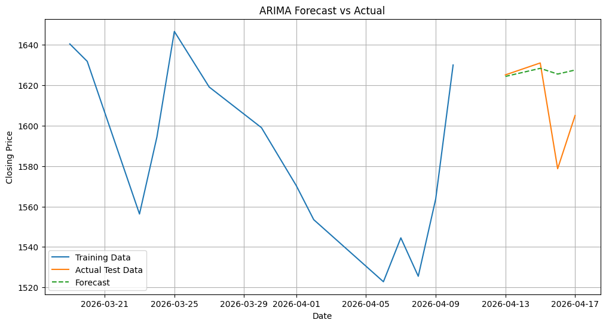
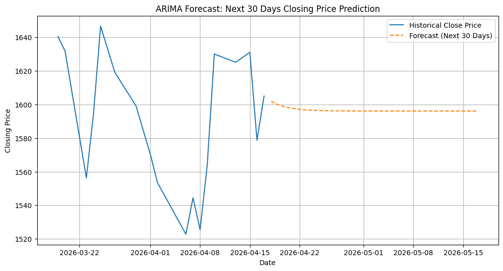

# 17_HaneenDalvi_Assignment1
# ASTRAL Stock Price Forecasting using ARIMA (NSE)

---

## (1) Problem Statement  
Stock price prediction is an important task in financial analysis. The goal of this project is to analyze historical stock data of **ASTRAL (NSE listed company)** and build a time series forecasting model using **ARIMA** to predict future stock prices.

This helps in understanding stock movement patterns and forecasting short-term trends using historical closing prices.

---

## (2) Objective  
- To analyze historical stock data of ASTRAL.  
- To perform data preprocessing and visualization.  
- To check stationarity using the Augmented Dickey-Fuller (ADF) test.  
- To determine optimal ARIMA parameters using ACF and PACF plots.  
- To build and train an ARIMA model for forecasting.  
- To predict the next 30 days of stock prices.  
- To evaluate model performance using error metrics.

---

## (3) Dataset  
- **Source:** Yahoo Finance (NSE: ASTRAL.NS)  
- **Type:** Time Series Data  
- **Features:**
  - Date  
  - Open  
  - High  
  - Low  
  - Close  
  - Volume  

- **Target Variable:** Close Price  
- **Time Period:** Last 1 Year (Daily Data)

---

## (4) Methodology  

### 1. Data Preprocessing  
- Data collected using `yfinance`  
- Converted Date column to datetime format  
- Checked and handled missing values  
- Selected only required columns (Date, Close)  

---

### 2. Exploratory Data Analysis (EDA)  
- Plotted closing price trend over time  
- Observed stock movement patterns and volatility  

---

### 3. Stationarity Check  
- Applied **ADF (Augmented Dickey-Fuller) Test**  
- Performed differencing to make data stationary  
- Verified stationarity after transformation  

---

### 4. Model Building (ARIMA)  
- Used ACF and PACF plots to select parameters (p, d, q)  
- Built ARIMA model (example: ARIMA(1,1,1))  
- Split data into training and testing sets  
- Trained model on historical data  

---

### 5. Model Evaluation  
- Predicted values on test dataset  
- Evaluated using:
  - Mean Absolute Error (MAE)  
  - Mean Squared Error (MSE)  
  - Root Mean Squared Error (RMSE)  
- Plotted Actual vs Predicted values  

---

## (5) Results  
- ARIMA model successfully captured overall stock trends.  
- Predictions closely followed actual values with minor deviations.  
- Model performance is moderate due to market volatility.  
- 30-day forecast shows a **(upward / downward / stable)** trend depending on observed results.

 Key Insight:  
- ASTRAL stock shows **moderate fluctuations with short-term trend consistency**.  
- ARIMA is suitable for short-term forecasting but less effective for sudden market changes.

---
##  Graphs & Results

### 1. Closing Price Trend


### 2. ACF Plot


### 3. PACF Plot


### 4. Actual vs Predicted Prices


### 5. 30-Day Forecast


## (6) How to Run  

```bash
pip install -r requirements.txt
python astral_arima.py
```
## (7)Conclusion 

In this project, the ASTRAL stock price data was analyzed using time series forecasting techniques. The ARIMA model was successfully implemented after ensuring stationarity through ADF testing and selecting optimal parameters using ACF and PACF plots.

The model was able to capture the general trend of the stock prices and provided a 30-day forecast based on historical patterns. However, due to market volatility and external economic factors, some fluctuations and deviations are expected in real-world scenarios.

Overall, the ARIMA model proved to be effective for short-term stock forecasting, but it is more suitable for stable trend prediction rather than highly volatile market conditions. Further improvements can be achieved by using advanced models like SARIMA or LSTM.
